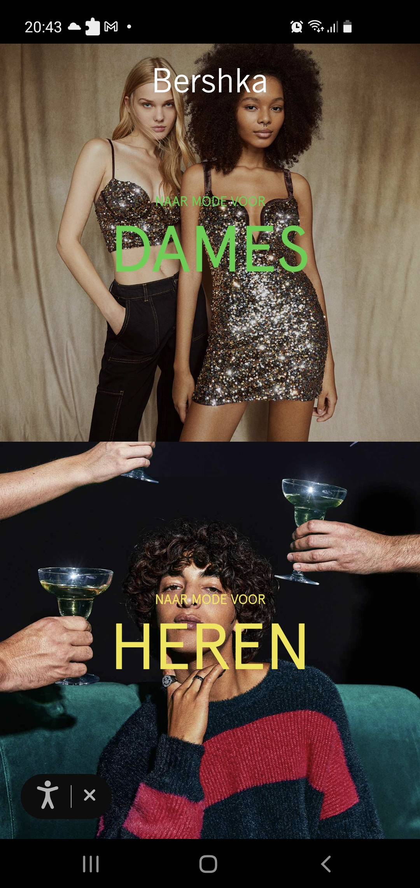
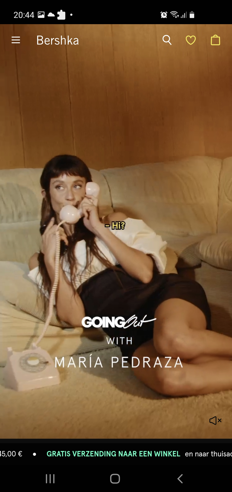
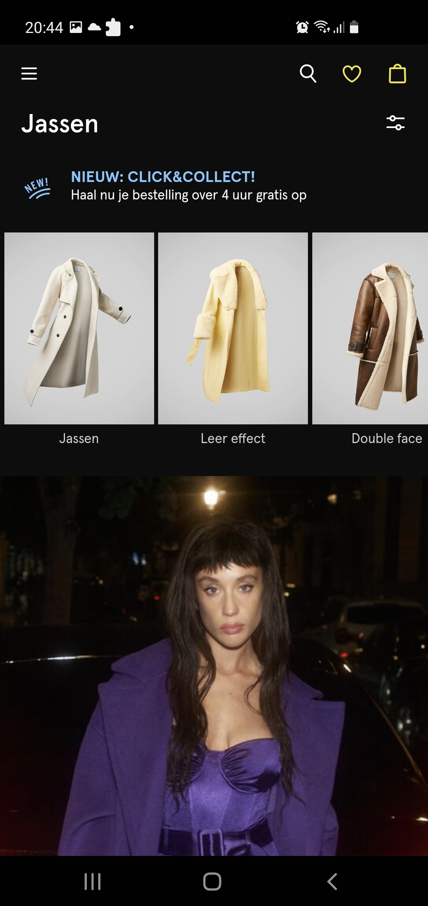
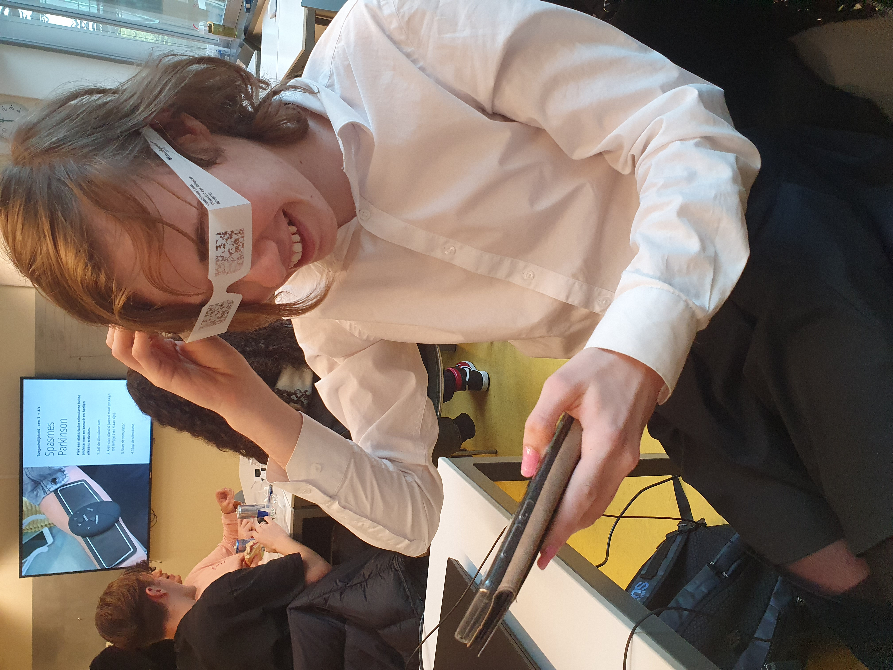
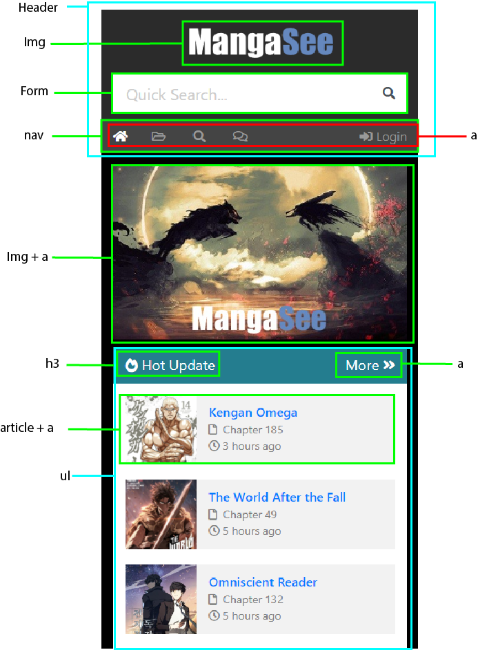
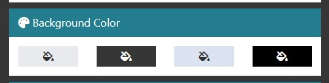
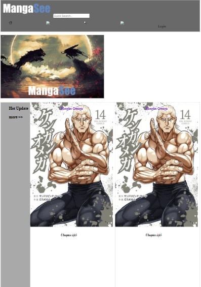
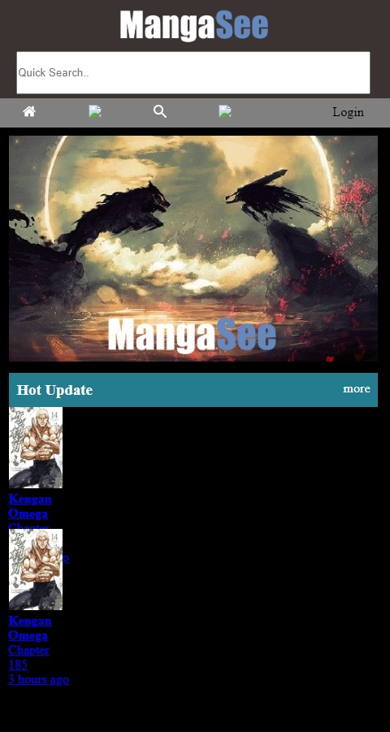

# Procesverslag
Markdown is een simpele manier om HTML te schrijven.  
Markdown cheat cheet: [Hulp bij het schrijven van Markdown](https://github.com/adam-p/markdown-here/wiki/Markdown-Cheatsheet).

Nb. De standaardstructuur en de spartaanse opmaak van de README.md zijn helemaal prima. Het gaat om de inhoud van je procesverslag. Besteedt de tijd voor pracht en praal aan je website.

Nb. Door *open* toe te voegen aan een *details* element kun je deze standaard open zetten. Fijn om dat steeds voor de relevante stuk(ken) te doen.

## Jij

  
uitwerken voor kick-off werkgroep

  ### Auteur:
 Tico Ligthart

  #### Je startniveau:
  blauw

  #### Je focus:
 responsive
 

## Je website

  
uitwerken voor kick-off werkgroep

  ### Je opdracht:
 Ik ga de Bershka site namaken
 https://www.bershka.com/nl/dames/kleding/jassen-c1010240019.html

  #### Screenshot(s) van de eerste pagina (small screen): 
  Bershka selectie screen 1
  
  
  
  
 Bershka home screen
  
   

  #### Screenshot(s) van de tweede pagina (small screen):
  Bershka jassen selectie
  
  
 

## Toegankelijkheidstest 1/2 (week 1)

  
De responsiveness van de site is slecht. De extra tools die verschijnen om mensen met disabilities te helpen zorgen ervoor dat de hele site breekt. Het hele scherm wordt grijs, het menu werkt niet goed meer en de site doet eigenlijk gewoon niks meer. Sommige dingen zijn wel goed gelinkt, zoals het bershka logo. Dit wordt opgenoemd als "Bershka logo, back to homepage". Maar het meeste is niet goed bruikbaar voor iemand die een narrator gebruikt. Zo zijn alt descriptions hetzelfde als de omschrijving die onder plaatjes staan, en worden alle html woorden constant in het rond geslingerd. 

  ### Bevindingen
  Lijst met je bevindingen die in de test naar voren kwamen:
  - De site is zonder zicht zeer slecht te navigeren.
  - Veel dingen zijn niet goed gelabeld.
  - Veel dingen staan klein en op elkaar, dus voor mensen die bijvoorbeeld parkisons hebben is het heel moeilijk om de site te navigeren. Ook zorgt dit ervoor dat   dingen snel onleesbaar worden als je zicht slechter is.

  #### Screenreader
Het is moeilijk te navigeren, veel dingen zijn slecht gelabeld.
Daarnaast breken de extra support tools de hele site.

Het is makkelijk om de html elementen de juiste namen en dat soort dingen te geven zodat de screen reader het niet fout afleest. Maar het feit dat de screen reader tools de site breken is niet makkelijk fix baar, want ik snap niet waarom dit gebeurt. 

  #### Muis en Toetsenbord 

De tab navigatie selecteert dingen die niet te zien zijn. Ook is de selector niet super duidelijk. Daarnaast is de volgorde waarin de tabselectie gaat niet super logisch, zo gaat het soms menus in die nog niet geopend zijn inplaats van naar de volgende item in het navigatie menu.

Een oplossing zou zijn de code semantisch correct maken door de juiste selector commands geven aan de items die in een uitklap menu staan (zodat je er niet doorheentabbed zonder dat deze opengaat) en met de focus selector command de selector duidelijker zichtbaar te maken. Als laatst kan je in de code gewoon elk selecteerbaar ding in een logische volgorde van boven naar benden in je code zetten zodat je met door tabben niet halverwegen van het ene menu naar het andere menu springt.

  #### Motoriek (shocks, elastiekjes)
De site is opzich prima navigeerbaar met de elastiekjes, maar veel dingen staan wel dicht op elkaar. Met de schokken maat dit het heel moeilijk om de site te navigeren.

Een makkelijke oplossing zou zijn om alle menutjes gewoon wat grooter te maken. De hoofd menus zijn dit al, maar de sub-menutjes zijn super klein. Geef ze gewoon wat meer ruimte, en ook maar direct wat meer letter grootte. Lost ook meteen het volgende probleem op:

  #### Visueel (brillen, contrast, kleurenblind, dark/light). 
Met een visuele beperking zijn alle kleinere menus al heel snel onleesbaar. De darktheme van de site werkt wel prima en er is ook genoeg contrast voor kleure blinde mensen.

De menus moeten gewoon wat groter gemaakt worden.
Hier zie je dat ik met een van de visuele beperking brillen op de site aan het lezen ben:

Achteraf blijkt dat de site op telefoon en het vormaat " telefoon" op computer compleet verschillend zijn. Dit en dat de support tools de site breken hebben ervoor gezorgd dat ik maar van site ben verandert (op 17/11/2022).

## Breakdownschets (week 1)

  
Ik ben van site overgestapt naar de site 'https://mangasee123.com'.

  ### de hele pagina: 
  

  ### dynamisch deel pagina 1, een menu om verschillende kleur modes aan te zetten. Ik ga hiermee een lightmode, darkmode en misschien nog eeen 
high contrast modes mee maken: 
  

## Voortgang 1 (week 2)

  
Ik ben begonnen aan de html van mjn site uitschrijven. Opzich denk ik dat dit wel goed gelukt is, maar ik ga het in de meeting nog laten checken.De CSS il nog niet echt lukken dus ik ben vanplan de student assistenten hier later mee lastig te vallen.

  ### Stand van zaken
  Wat ging goed?
  Ik vind het leuk om hier aan te werken, maar er is nog niet super veel goed gegaan moet ik zeggen.
  
  Wat ging minder?
  Ondanks de opdrachten te hebben gedaan en de code terugbeken te hebben kom ik niet uit de css. De header wil niet met flexbox staan zoals ik wil, de articles waar ik dan weer grid voor gebruik vallen niet mooi binnen een blokje. Ik snap er niks van. Ik moet maar in het gesprek later het er even over hebben (of      studentassistenten na afloop vragen).
     
  Hier de html, css en hoe het eruit ziet:
  

    <!DOCTYPE html>
<html lang="en">
<head>
    <meta charset="UTF-8">
    <title>Document</title>
    <link rel="stylesheet" href="../css/mangasee.css">
</head>

<body>
    
     <!--header waar in het logo, de zoek balk en het navigatie menu moeten zitten -->
    <header>
         
         <input type="text" placeholder="Quick Search.." >
         
      
        <ul>
             <li>
                 
             </li>
             <li>
                 
             </li>
             <li>
                  
             </li>
             <li>
                 
             </li>
             <li>
                 
Login

             </li>
         </ul>
        
    </header>
 
    <main>
        
        
         <ul>
            
            <li>
             <h3>Hot Update</h3> <h3>more >></h3>
            </li>
             
            <li>
                 <article>
                     
                     <h4>Kengan Omega</h4>
                     
 Chapter 185

                     
 3 hours ago

                 </article>
                 
            </li>
            
             <li>
                 <article>
                     
                     <h4>Kengan Omega</h4>
                     
 Chapter 185

                     
 3 hours ago

                 </article>
                 
            </li>
         </ul> 
    </main>
    
    
    
</body>
</html>
 
 Dan de css:
/*--bgcolor:  color: darkgray;
--bgcolor2: color: black; */
/* */
header{
    /*background-color:var(--bgcolor); */
    background-color: dimgray;
    
}

main{
    /*background-color: var(--bgcolor2);*/
    /*background-color: black;*/
}

main:nth-of-type(1) a{
/* om plaatje te positioneren ater */
}

/* the top nav */
/* makes it so the nav menu doesnt have those dots */
ul{
    list-style: none;
    display: flex;
}

ul:nth-of-type(1) li{
    flex-grow: 1;
}

/* The articles */

main ul{
        list-style:none; 
        background-color: darkgrey;
}

main:nth-of-type(1) li{
    
}

li article{
    background-color: white;
    display:grid;
    grid-template-rows: 1fr 1fr 1fr;
    grid-template-columns: 1fr 2fr;
    grid-gap: 1em;
}

article img{
  grid-row-start:1;
  grid-column-start: 1;
  grid-column-end: -1;
}

article h4{
    color: blueviolet;
  grid-row-start:1;
  grid-column-start: 2;
}

article:nth-child(1) p{
  grid-row:2;
  grid-column-start: 2;
}

article:nth-child(2) p{
  grid-row-start:3;
  grid-column-start: 2;
}

en hoe het eruit ziet:
  
 

  ### Agenda voor meeting
  samen met je groepje opstellen
 1. Tico - html checken, misschien nog css hulp???
 2. Naomi - html checken, fouten eruit halen
 3. Kars - html checken
 4. Brett - html checken, breakdown schets doornemen

  ### Verslag van meeting
 Tijdens de meeting durfde ik mijn werk niet zo goed aan mijn medestudenten te laten zien. Maar uiteindelijk heb ik het er wel gewoon over gehad met de student   assistent Sasja. We hebben het even over mijn grids gehad en dat ik hetzelfde kan bereiken met flexbox. Dat ik de images gewoon kan resizes met height/width en misschient met cover in de blokjes kan zetten. Ik heb een aantal artikelen gelinked gekregen:
 https://krasimirtsonev.com/blog/article/CSS-before-and-after-pseudo-elements-in-practice voor before en after commands om plaatjes voor en na tekst te platen,
 https://developer.mozilla.org/en-US/docs/Web/CSS/object-fit?retiredLocale=nl en een linkje over objectfit voor de maga plaatjes.

## Voortgang 2 (week 3)

  
uitwerken voor 2e voortgang

  ### Stand van zaken
Samen met de student assistent Thomas heb ik het voor elkaar gekregen om met flexbox de header in orde te krijgen. Zo staat het logo nu mooi boven aan, met de zoek balk eronder en de navigatie balk daar weer onder mooi in een rijtje. De icoontjes zijn nog niet allemaal in orde maar dat komt nog wel, momenteel ben ik aan het proberen het hot update blokje helemaal mooi te krijgen, want me tot mijn frustratie deze week nogsteed niet wil lukken.
  
  dit is hoe het eruit ziet:
  

  En hier is de html en css
  

    <!DOCTYPE html>
<html lang="en">
<head>
    <meta charset="UTF-8">
    <title>Document</title>
    <link rel="stylesheet" href="./css/mangasee.css">
</head>

<body>
    
     <!--header waar in het logo, de zoek balk en het navigatie menu moeten zitten -->
    <header>      
        
        <input type="text" placeholder="Quick Search.." >
        <nav> 
        <ul>

             <li>
                 
             </li>
        
             <li>
                 
             </li>
             
             <li>
                
             </li>
             
             <li>
                
             </li>
             
             <li>
                <a>
                 
Login

                </a>
             </li>
         </ul>
        </nav>
    
    </header>
 
 <main>
        
        
     <section>

         

         <h3>Hot Update</h3> 
         <a>more</a>
         

        <ul>
             
            <li>
               
                    <a href="indexmangasee.html">
                     
                     <section>
                     <h4>Kengan Omega</h4>
                     
 Chapter 185

                     
 3 hours ago

                     </section>
                    </a>
                 
            </li>
            <li>
              
                   <a href="indexmangasee.html">
                    
                    <section>
                    <h4>Kengan Omega</h4>
                    
 Chapter 185

                    
 3 hours ago

                    </section>
                   </a>
                 
           </li>
         
         </ul>
     </section>

    </main>
    
    
    
</body>
</html>
    
 En dan de css:
    /**************/
/* CSS REMEDY */
/**************/
*, *::after, *::before {
  box-sizing:border-box;  
  margin: 0;
  padding: 0;
}

button, summary {
	cursor: pointer;
}

/*********************/
/* CUSTOM PROPERTIES */
/*********************/
:root{
	--bgcolor: #3B3331;
	--bgcolor2: black; 
	}

/****************/
/* JOUW STYLING */
/****************/

/* jouw code */

body{
	background-color: black;
}

/* Css om de header goed te krijgen */

header{
	display: flex;
	background-color: var(--bgcolor);
	flex-direction:column;
}

header input{
	width: 90%;
	height: 4em;
	margin:auto;
	margin-bottom: 5px;
}

header > img{
	height: 4em;
	margin: auto;
}

header ul{
	display: flex;
	list-style:none;
	background-color: gray;

}

nav ul li{
	margin-top: 10px;
	margin-bottom: 10px;
	padding: 0.5em 0.5em;
	margin: 0 5%;

	
}

nav ul li:last-of-type{
	margin-left: auto;
}

main {
margin: 0 3%;
}

main > img{
	width: 100%;
	margin-top: 10px;
	margin-bottom: 10px;
}

section:first-of-type div{
display: flex;
justify-content: space-between;
background-color: #247d8f;
padding: 0 0.7em;
color: white;
padding: 10px;
}

main section {
display: flex;
flex-direction: column;
}

main section ul li{
	display: grid;
	grid-template-areas: 1 / 1 / 3 / 4;
	grid-template: 50px 50px 50px / 75px 300px
}

section ul li img{
grid-column: 1 / 2;
grid-row: 1 / 4;
height: 100px;
}

section ul h4{
grid-column 2 / 3;
grid-row: 1 / 2;
}

section ul p:nth-of-type(1){
grid-column: 2 / 3;
grid-row: 2 / 3
}

section ul p:nth-of-type(2){
grid-column: 2 / 3;
grid-row: 3 / 4;
}
  

  ### Agenda voor meeting
  samen met je groepje opstellen

1. Kars: "Ik wil kijken naar mijn code en bespreken waar ik sta".
2. Brett: "Ik wil kijken naar de grid op mijn homepagina want daar kom ik niet helemaal uit".
3. Tico: " Ik wil mijn html/css even doornemen".
4. Naomi: " Ik wil vragen wat ik moet doen voor een voldoende".

  ### Verslag van meeting
  
  Ik heb uit de meeting gehaald dat ik gewoon een div mag gebruiken voor de blokjes binnen het " hot update"  gedeelte. Hierdoor wordt alles met flexbox op orde zetten   een stuk makkelijker. Ook heb ik hulp gekregen met zorgen dat de manga plaatjes eindelijk binnen de blokjes vallen met gebruik van aspect ratios en object-fit.

## Toegankelijkheidstest 2/2 (week 4)

  
Ik heb de mangasee site getest op usability en vergeleken met mijn eigen site.

  ### Bevindingen
  Lijst met je bevindingen die in de test naar voren kwamen (geef ook aan wat er verbeterd is):

  #### Screenreader
 Screen reader werkt op de orginele site niet super goed.
 Op mijn versie van de site hebben alle plaatjes alt text en worden de meeste dingen goed uitgesproken, maar soms leest het apparaat nogsteeds een lijn code voor.

Ik moet de juiste labels aan sommige van mijn invoer velden toevoegen.

  #### Muis en Toetsenbord 
  Met muis en toetsenbord werkt nauwelijks op de originele site omdat de selector compleet onzichtbaar is.
  Op mijn versie van de site werkt muis en toetsenbord prima, omdat ik de focus state heel duidelijk heb gemaakt met kleuren die bij de site passen.

  #### Motoriek (shocks, elastiekjes)
 Met elastiekjes is de originele site prima te navigeren.
 Mijn site lijkt erg op de originele site dus hiervoor is niet veel anders. Wel kan bij beide de top navigatie misschien iets groter zodat het makkelijker
aan te klikken is.

  #### Visueel (brillen, contrast, kleurenblind, dark/light). 
  De site heeft redelijk hoog contrast uitzichzelf dus is het met de meeste visuele beperkingen prima te zien. Sommige tekst is licht grijs op wit wat wel lastig te zien is.

  Op mijn eigen versie van de site heb ik de tekst zwart gemaakt. Zwart op wit nis namelijk gewoon goed te lezen.

## Voortgang 3 (week 4)

  
 Ik heb deze week de selectors van mijn site gefixt en door de hulp van het vorige voortgangsproces mijn site net zo gekregen als het origineel eruit ziet. Ik ben hier erg blij mee want aan het begin van dit blok kon ik dit nog echt niet. Alleen ben ik er achter gekomen dat mijn site als ik een website window aanpas naar de grote van een telefoon scherm het er goed uitziet, maar als ik in f12 het knopje aan klik om de site op de proporties van een telefoon scherm te zetten alles heel klein wordt. Op mijn telefoon zien dingen er al helemaal anders uit

  ### Stand van zaken
  De site ziet er nu goed uit. Ik ben tevreden met mijn html en css. Maar met javascript de light modus maken is nog niet helemaal gelukt. Ook ziet de site er vreemd uit met de f12 modus. Online heb ik gelezen dat ik dit misschien met media quiery kan fixen dus daar ga ik in de meeting over vragen.

  ### Agenda voor meeting
  samen met je groepje opstellen

  1. Kars: “Ik wil mijn HTML, CSS doorlopen en vragen wat het beste is om te doen om de vaart erin te houden.”
  2. Brett: "Ik wil mijn site globaal scannen."
  3. Tico: "Ik heb wat vragen over media quiery en wil mijn site doornemen."
  4. Naomi: "Ik heb nog wat specifieke vragen."

  ### Verslag van meeting
  hier na afloop snel de uitkomsten van de meeting vastleggen

 1. Inplaats van media quiery kan ik gewoon met viewports de grote verandering fixen.
 2. Ik heb wat advies gekregen om mijn selectors te verbeteren. 
 3. Op de telefoon van de student assistent zien dingen er wel gewoon normaal uit. Het ligt aan mijn telefoon.

## Eindgesprek (week 5)

  
Ik heb de 2e pagina nog niet af, ook is de lightmode me nog niet gelukt. Hierdoor weet ik dat ik sowieso oet herkansen. Wel kan ik de feedback gebruiken.

  ### Je uitkomst - karakteristiek screenshots:
 Nog niet af

  ### Dit ging goed/Heb ik geleerd: 
  Ik heb veel over flexbox en positionering geleerd. Eindelijk kan ik dingen een beetje normaal op hun plek zetten zoals ik in mijn hoofd heb. 

  

  ### Dit was lastig/Is niet gelukt:
  Korte omschrijving met plaatjes

  

## Bronnenlijst

  
continu bijhouden terwijl je werkt

  Nb. Wees specifiek ('css-tricks' als bron is bijv. niet specifiek genoeg).

  1. bron 1
  2. bron 2
  3. ...

